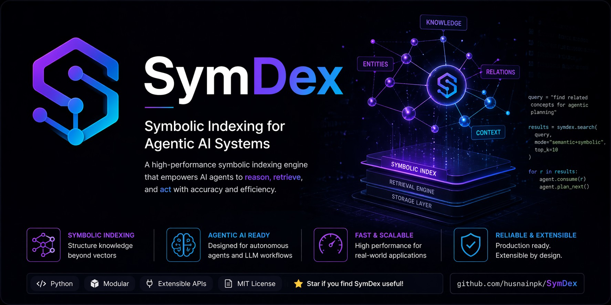

<div align="center">

<p>
  
</p>

# SymDex

**Symbolic indexing for agentic AI systems.**

*SymDex turns a checked-out repository into a local symbolic index of code structure, routes, relations, docs, tests, and context so AI coding agents can reason, retrieve, and act without reading whole files first.*

<br>

[](https://pypi.org/project/symdex/)
[](https://pypi.org/project/symdex/)
[](https://pypi.org/project/symdex/)
[](https://github.com/husnainpk/symdex/blob/main/LICENSE)
[](https://github.com/husnainpk/symdex/stargazers)

<br>

[](https://cursor.sh)
[](https://github.com/openai/codex)
[](https://github.com/google-gemini/gemini-cli)
[](https://github.com/features/copilot)
[](https://codeium.com/windsurf)
[](https://roocode.com)
[](https://kilocode.ai)

<br>

<h2 align="center">From whole-file browsing to exact repo retrieval</h2>
<p align="center"><strong>Exact symbols, routes, callers, callees, file outlines, semantic matches, and token-budgeted context packs for coding agents.</strong></p>

```bash
# Install the lean core
pip install symdex

# Add local semantic search when you want the sentence-transformers backend
pip install "symdex[local]"

# Or install the local semantic backend as an isolated CLI tool
uv tool install "symdex[local]"

# Or run without installing
uvx symdex --help

# Upgrade an existing install
py -m pip install -U symdex
uv tool upgrade symdex
uvx symdex@latest --help

# Install the SymDex agent skill globally for supported agents
npx skills add https://github.com/husnainpk/SymDex --skill symdex-code-search --yes --global
```

</div>

---

## What SymDex Does

SymDex is a repo-local symbolic indexing engine for AI coding agents. It maps a project into exact symbols, files, routes, relations, docs, tests, and retrieval context, then exposes that map through CLI commands and MCP tools.

AI coding agents are useful until they have to rediscover your repo from scratch. They open whole files, grep broad patterns, miss the route handler, read the same utility twice, and spend thousands of tokens just getting oriented.

SymDex gives agents a repo-local retrieval layer before they start reading code. You keep the index on your machine, choose the embedding backend only when semantic search is useful, and expose the same project map through both CLI commands and MCP tools.

It indexes your project into a small local SQLite knowledge base with:

- exact symbols and byte offsets
- file outlines and repo summaries
- literal text search
- optional semantic search
- callers, callees, and circular dependency checks
- extracted HTTP routes
- query-driven context packs that assemble small evidence bundles from symbols, routes, docs, tests, text, graph neighbors, and optional semantic matches
- retrieval quality metadata for freshness, confidence, parser mode, generated paths, and embedding availability
- a registry for one repo, many repos, or many worktrees

Then agents can ask for the narrow slice they need: the function, route, caller chain, file outline, intent match, or a token-budgeted context pack for a broader feature question. That means less blind browsing, less context waste, and responses that can explain how much token budget SymDex saved.

SymDex is local-first. Base `symdex` keeps symbol, text, route, graph, and MCP features lean. Install `symdex[local]` only when you want local semantic embeddings, or point the hosted backend at Voyage, OpenAI-compatible services, Gemini, or a compatible proxy when you want remote embeddings.

Current product capabilities in this checkout:

- current release `0.1.26`; latest public tag `v0.1.26`
- 21 MCP tools across indexing, search, context packs, outlines, routes, stats, graphs, cache invalidation, and stale-index cleanup
- 21 language surfaces, including HTML, CSS, Shell, Svelte, Markdown headings, and supported fenced code blocks
- Android, Flutter, and iOS coverage through Kotlin, Dart, and Swift parser targets
- route extraction across Python, JavaScript/TypeScript, Spring/Kotlin, Laravel, Gin-style Go, ASP.NET, Rails/Sinatra, Phoenix, and Actix
- one-line CLI token-savings footers after successful search commands
- MCP `roi`, `roi_summary`, and `roi_agent_hint` fields so agents can mention savings in their final response
- MCP and CLI JSON `quality` fields so agents can judge confidence, index freshness, parser mode, generated paths, and embedding availability before reasoning from a result
- `symdex pack` and MCP `build_context_pack` for query-shaped, token-budgeted evidence bundles
- semantic backends for local `sentence-transformers`, Voyage, OpenAI-compatible `/embeddings`, and Gemini Embedding
- `SYMDEX_EMBED_RPM` request pacing for hosted embedding providers
- `symdex index --lazy` for fast foreground structural indexing while embeddings build in a background watcher
- low-memory `symdex watch` by default: structural refresh without loading embedding models unless `--embed` is passed
- duplicate watcher protection, idle auto-exit, and state-aware watcher metadata
- workspace-local `./.symdex` state for Docker, portable workspaces, and teams that do not want indexes hidden in home directories
- upgrade notices with exact `pip`, `uv tool`, and `uvx` commands when a newer release exists

---

## SymDex Skill For Agents

Install the SymDex code-search skill when you want supported agents to use SymDex before broad file browsing:

```bash
npx skills add https://github.com/husnainpk/SymDex --skill symdex-code-search --yes --global
```

If you want the interactive installer instead, omit `--yes --global`.

The skill tells agents to:
- check repo and index readiness first
- search with SymDex before broad Read/Grep/Glob discovery
- prefer symbol-level and outline-level retrieval over full-file reads
- use callers, callees, routes, repo stats, and semantic search when those are the better fit
- use context packs for broader "how does this feature work?" questions before many separate searches
- fall back clearly when SymDex is unavailable or when semantic embeddings have not been built
- keep the workflow centered on lower-token code retrieval instead of broad file reads

The skill lives in this repo at `skills/symdex-code-search/SKILL.md` and follows the standard `skills/<name>/SKILL.md` layout.

Installing through the `skills` CLI uses the same public path that skills.sh indexes.

---

## 60-second quickstart

```bash
# Install the lean core
pip install symdex
# or
uv tool install symdex

# Index a project
symdex index ./myproject --repo myproject

# Search by symbol name
symdex search "validate_email" --repo myproject

# Search by literal text
symdex text "JWT" --repo myproject

# Add local semantic search only when you want embeddings
pip install "symdex[local]"

# Search by intent
symdex semantic "check email format" --repo myproject

# Build a token-budgeted context pack for an agent
symdex pack "how checkout auth works" --repo myproject --budget 6000

# Show HTTP routes
symdex routes myproject -m POST

# Start the MCP server
symdex serve
```

Notes:
- If you omit `--repo` on `symdex index` or `symdex watch`, SymDex auto-generates a stable repo id from the current git branch and worktree path hash.
- After indexing, SymDex prints a code summary.
- After successful search commands, SymDex prints a one-line ROI footer with approximate token savings.
- MCP search tools also return `roi_agent_hint`, so agents can fold the savings into their user-facing response instead of burying it in logs.
- When a newer PyPI release exists, normal CLI commands print exact upgrade commands for `pip`, `uv tool`, and `uvx`.
- Set `SYMDEX_STATE_DIR=.symdex` on first index to keep repo databases, `registry.db`, and `registry.json` inside the current workspace. After that, commands run from the workspace auto-discover the local state.
- `--state-dir` can be passed either globally or after the subcommand, for example `symdex --state-dir .symdex repos` or `symdex repos --state-dir .symdex`.
- Canonical CLI commands are `index` and `repos`. Shell compatibility aliases also accept MCP-shaped names like `index-folder`, `index-repo`, and `list-repos`.
- Semantic search requires stored embeddings. If a repo was indexed before the backend you want was enabled, re-index it with `symdex index`, `symdex index --lazy`, or `symdex watch --embed`.

Add to your agent config:

```json
{
  "mcpServers": {
    "symdex": {
      "command": "uvx",
      "args": ["symdex", "serve"]
    }
  }
}
```

HTTP mode:

```json
{
  "mcpServers": {
    "symdex": {
      "url": "http://localhost:8080/mcp"
    }
  }
}
```

---

## Workspace-local state and Docker

SymDex defaults to `~/.symdex` and also supports a workspace-local state directory for portable and containerized workflows.

Use it like this on first setup:

```bash
SYMDEX_STATE_DIR=.symdex symdex index ./myproject --repo myproject
```

That creates:

- `./.symdex/<repo>.db`
- `./.symdex/registry.db`
- `./.symdex/registry.json`

`registry.json` is the human-readable manifest. In workspace-local mode it stores relative `root_path` and `db_path` values, so you can inspect what is indexed without opening SQLite.

After the local state exists, SymDex auto-discovers it from the current workspace or any nested subdirectory.

---

## What you get

<p align="center">
  
</p>

| Feature | Details |
|---|---|
| Symbol search | Find functions, classes, and methods with exact byte offsets |
| Semantic search | Find code by intent instead of exact name |
| Text search | Search indexed files by literal text across the repo |
| Byte-precise retrieval | Read only the symbol span you need |
| File outline | List symbols in a file without transferring the whole file |
| Repo outline | Get a directory tree plus repo summary through MCP |
| Call graph | Trace callers, callees, and circular dependencies |
| HTTP routes | Extract Flask, FastAPI, Django, Express, Spring/Kotlin, Laravel, Gin-style Go, ASP.NET, Rails/Sinatra, Phoenix, and Actix routes |
| Context packs | Build token-budgeted evidence bundles from symbols, routes, text, docs, tests, graph neighbors, and optional semantic matches |
| Markdown-aware docs | Index Markdown headings and supported fenced code blocks for SDK docs, specs, repo docs, and design notes |
| Auto-watch | Re-index on change, avoid duplicate watchers, stay low-memory by default, and auto-exit after idle time |
| Cross-repo registry | Manage multiple indexed repos from one local registry |
| Workspace-local state | Keep repo databases, `registry.json`, and watcher metadata inside `./.symdex` for Docker and portable workspaces |
| Search ROI footer | One-line approximate token savings after successful search commands |
| Agent ROI hint | MCP tools return `roi_agent_hint` so agents can mention savings naturally in their replies |
| Retrieval quality metadata | MCP and CLI JSON outputs expose confidence, freshness, parser mode, language surface, generated-file hints, and embedding availability |
| Code summary | Files, Lines of Code, symbols, routes, skipped files, and languages after indexing |
| Optional embedding backends | Use local embeddings, Voyage, OpenAI-compatible `/embeddings`, Gemini, or a compatible proxy only when needed |

---

## Where SymDex Fits

AI codebase tools now split into a few strong categories: enterprise code search, IDE-native assistants, LSP-backed agent toolkits, repo-map systems, and whole-repo prompt packers. SymDex sits in a narrower but useful slot: a local-first retrieval layer that combines exact symbols, text search, optional semantic search, query-driven context packs, HTTP routes, callers, callees, file outlines, repo outlines, Markdown/fenced-code indexing, repo stats, token-savings hints, retrieval quality metadata, CLI access, and MCP access without requiring an editor session or hosted index.

That makes SymDex strongest when an agent needs a portable codebase map it can query before reading files.

| Need | Common fit | Where SymDex fits |
|---|---|---|
| Enterprise code search across many hosted repos | Sourcegraph-style code search | SymDex is smaller and local-first; it focuses on agent retrieval from checked-out worktrees rather than enterprise code search operations |
| IDE-native codebase chat and autocomplete | Cursor, Continue, Cody, and similar editor assistants | SymDex is editor-agnostic; agents can use the same repo index from a terminal, stdio MCP, or HTTP MCP client |
| IDE-grade semantic retrieval and refactoring | LSP-backed tools and Serena-style agent toolkits | SymDex does not try to be a refactoring engine; it focuses on retrieval primitives agents need before deciding what to edit |
| Whole-repo context packaging | Repomix and other prompt-packing tools | SymDex builds query-driven context packs from indexed evidence instead of packing the whole repository into one prompt artifact |
| Agent repo maps for coding sessions | Aider-style repository maps | SymDex exposes queryable indexes, token-budgeted context packs, routes, call graphs, Markdown headings, semantic search, ROI hints, and retrieval quality metadata rather than only a condensed map |
| Lightweight local retrieval across code and docs | SymDex | SymDex's edge is the combined surface: CLI + MCP, SQLite indexes, 21 language surfaces, context packs, route extraction, call graphs, Markdown/MDX support, retrieval quality signals, optional embeddings, low-memory watch, and workspace-local state |

Use a language server when you need deep type-system reasoning or editor-native refactors. Use an enterprise code search platform when you need organization-wide search, permissions, and code monitoring. Use a prompt packer when you want to hand an entire repo snapshot to a model. Use SymDex when you want an AI coding agent to ask precise repo-local questions before it spends tokens reading files.

---

## CLI reference

```bash
# Indexing and maintenance
symdex index ./myproject --repo myproject       # Index with an explicit repo id
symdex index ./myproject                        # Auto-name from git branch + path hash
symdex index ./myproject --repo myproject --no-embed  # Skip semantic embedding work
symdex index ./myproject --repo myproject --lazy      # Index code now, embed in a background watcher
symdex watch ./myproject --repo myproject       # Keep an index fresh without loading embedding models
symdex watch ./myproject --repo myproject --embed  # Also refresh semantic embeddings on change
symdex invalidate --repo myproject              # Force re-index of a repo
symdex invalidate --repo myproject --file app.py
symdex gc                                       # Remove stale index databases
symdex repos                                    # List indexed repos

# Search
symdex search "validate_email" --repo myproject
symdex search "validate_email"                 # Search across all indexed repos
symdex find validate_email --repo myproject     # Exact lookup
symdex text "JWT" --repo myproject
symdex semantic "check auth token" --repo myproject
symdex pack "how auth token refresh works" --repo myproject --budget 6000
symdex pack "document checkout API" --repo myproject --include routes,docs,tests --format json

# Navigation
symdex outline auth/utils.py --repo myproject
symdex callers validate_email --repo myproject
symdex callees validate_email --repo myproject
symdex routes myproject
symdex routes myproject --method POST
symdex routes myproject --path /api

# Server
symdex serve
symdex serve --port 8080
```

MCP currently exposes additional repo-tree and repo-stats views that are not surfaced as dedicated CLI commands: `get_file_tree`, `get_repo_outline`, `get_index_status`, and `get_repo_stats`.

---

## MCP tools

SymDex currently exposes 21 MCP tools:

| Tool | Purpose |
|---|---|
| `index_folder` | Index a local folder and return indexing statistics |
| `index_repo` | Index a repo and register it in the central registry |
| `search_symbols` | Find functions, classes, and methods by name |
| `semantic_search` | Find symbols by meaning using embedding similarity |
| `search_text` | Search indexed files by text and return matching lines |
| `build_context_pack` | Build a token-budgeted evidence bundle for an agent query |
| `get_symbol` | Read one symbol by byte offsets |
| `get_symbols` | Bulk exact-name symbol lookup |
| `get_file_outline` | List symbols in a single file |
| `get_file_tree` | Return a directory tree without file contents |
| `get_repo_outline` | Return a repo tree plus summary stats |
| `get_callers` | Return symbols that call a named function |
| `get_callees` | Return symbols called by a named function |
| `search_routes` | Query extracted HTTP routes |
| `get_index_status` | Return symbol count, file count, Lines of Code, staleness, and watcher state |
| `get_repo_stats` | Return repo metrics such as language mix, fan-in, fan-out, and circular dependency count |
| `get_graph_diagram` | Generate a Mermaid call graph |
| `find_circular_deps` | Detect circular dependencies |
| `list_repos` | List all indexed repos |
| `invalidate_cache` | Force re-index on next use |
| `gc_stale_indexes` | Remove index databases for repos that no longer exist on disk |

---

## Supported languages

| Language | Extensions |
|---|---|
| Python | `.py` |
| JavaScript | `.js`, `.jsx`, `.mjs`, `.cjs`, `.cjsx`, `.mjsx` |
| TypeScript | `.ts`, `.tsx`, `.mts`, `.cts`, `.mtsx`, `.ctsx` |
| Go | `.go` |
| Rust | `.rs` |
| Java | `.java` |
| Kotlin | `.kt`, `.kts` |
| Dart | `.dart` |
| Swift | `.swift` |
| PHP | `.php` |
| C# | `.cs` |
| C | `.c` |
| C++ | `.h`, `.hh`, `.hpp`, `.hxx`, `.cpp`, `.cc`, `.cxx` |
| HTML | `.html`, `.htm` |
| CSS | `.css`, `.scss`, `.sass`, `.less`, `.stylus`, `.styl` |
| Shell | `.sh`, `.bash`, `.zsh` |
| Elixir | `.ex`, `.exs` |
| Ruby | `.rb` |
| Vue | `.vue` script blocks parsed as JavaScript or TypeScript |
| Svelte | `.svelte` script blocks parsed as JavaScript or TypeScript |
| Markdown | `.md`, `.markdown`, `.mdx` headings plus supported fenced code blocks |

Powered by [tree-sitter](https://tree-sitter.github.io/tree-sitter/) for code, language-pack grammar fallbacks, and a native Markdown scanner for headings and fenced code examples.

---

## Supported platforms

SymDex works with any MCP client that supports stdio or streamable HTTP.

| Platform | Typical setup |
|---|---|
| Codex CLI | Add to MCP settings |
| Gemini CLI | Add to MCP settings |
| Cursor | `.cursor/mcp.json` |
| Windsurf | Add to MCP settings |
| GitHub Copilot | `.vscode/mcp.json` |
| Roo | Add to MCP settings |
| Continue.dev | `config.json` |
| Cline | Add to MCP settings |
| Kilo Code | VS Code MCP settings |
| Zed | Add to MCP settings |
| OpenCode | `opencode.json` |
| Any MCP client | `uvx symdex serve` or `symdex serve --port 8080` |

---

## Semantic embedding backends

Base `symdex` installs the lean core only. Choose the embedding extra that matches how you want semantic search to work:

- `symdex[local]` for local `sentence-transformers`
- `symdex[voyage]` for Voyage text embeddings
- `symdex[voyage-multimodal]` for Voyage text plus images and PDFs

Remote OpenAI-compatible and Gemini backends use the Python standard library HTTP client, so they do not add a required dependency.

### Local mode

```bash
pip install "symdex[local]"

SYMDEX_EMBED_BACKEND=local \
SYMDEX_EMBED_MODEL=all-MiniLM-L6-v2 \
symdex index . --repo myrepo
```

### Voyage text mode

```bash
pip install "symdex[voyage]"

SYMDEX_EMBED_BACKEND=voyage \
VOYAGE_API_KEY=... \
SYMDEX_VOYAGE_MODEL=voyage-code-3 \
symdex index . --repo myrepo

SYMDEX_EMBED_BACKEND=voyage \
VOYAGE_API_KEY=... \
symdex semantic "parse source code" --repo myrepo
```

### OpenAI-compatible mode

Use this for OpenAI, local OpenAI-compatible servers, and proxy services that expose `POST /embeddings`.

```bash
SYMDEX_EMBED_BACKEND=openai \
SYMDEX_EMBED_BASE_URL=https://api.openai.com/v1 \
SYMDEX_EMBED_MODEL=text-embedding-3-small \
SYMDEX_EMBED_API_KEY=... \
SYMDEX_EMBED_RPM=60 \
symdex index . --repo myrepo --lazy
```

For a local or proxy provider, set `SYMDEX_EMBED_BACKEND=custom`, point `SYMDEX_EMBED_BASE_URL` at its `/v1` base URL, and set the model name it expects. If the provider does not need an API key, omit `SYMDEX_EMBED_API_KEY`.

### Gemini mode

Gemini uses `RETRIEVAL_DOCUMENT` when indexing and `RETRIEVAL_QUERY` when searching.

```bash
SYMDEX_EMBED_BACKEND=gemini \
GEMINI_API_KEY=... \
SYMDEX_EMBED_MODEL=text-embedding-004 \
SYMDEX_EMBED_RPM=60 \
symdex index . --repo myrepo --lazy
```

### Voyage multimodal mode

```bash
pip install "symdex[voyage-multimodal]"

SYMDEX_EMBED_BACKEND=voyage
SYMDEX_VOYAGE_MULTIMODAL=1
VOYAGE_API_KEY=...
SYMDEX_VOYAGE_MULTIMODAL_MODEL=voyage-multimodal-3.5
symdex index . --repo myrepo
```

Multimodal mode lets SymDex index supported images, screenshots, and PDFs as searchable asset entries.

Notes:
- Base `symdex` keeps symbol, text, route, and call-graph features without pulling in the local embedding stack.
- If `SYMDEX_EMBED_BACKEND` is unset, SymDex uses the local backend when `symdex[local]` is installed.
- Local semantic search requires `symdex[local]` and downloads the model on first use.
- Voyage text mode requires `symdex[voyage]`.
- Voyage multimodal mode requires `symdex[voyage-multimodal]`.
- OpenAI-compatible mode reads `SYMDEX_EMBED_BASE_URL`, `SYMDEX_EMBED_MODEL`, and optional `SYMDEX_EMBED_API_KEY` or `OPENAI_API_KEY`.
- Gemini mode reads `SYMDEX_EMBED_MODEL`, `SYMDEX_EMBED_BASE_URL`, and `SYMDEX_EMBED_API_KEY`, `GEMINI_API_KEY`, or `GOOGLE_API_KEY`.
- `SYMDEX_EMBED_RPM` applies request pacing to remote backends. Use it when free tiers or proxies enforce requests-per-minute limits.
- `symdex index --lazy` performs the fast structural index first, then starts a background `symdex watch --embed` process so embeddings can fill in without blocking the foreground command.
- `symdex index --no-embed` skips semantic embedding work entirely.
- If the selected backend extra is missing, SymDex prints an actionable install hint.
- Multimodal indexing is only active when `SYMDEX_VOYAGE_MULTIMODAL=1`.

---

## FAQ

### What is SymDex?

SymDex is a repo-local symbolic indexing engine for AI coding agents. It indexes a project into a local SQLite knowledge base so agents can retrieve exact symbols, file outlines, HTTP routes, callers, callees, text matches, semantic matches, token-budgeted context packs, and repo summaries without reading whole files first.

### What problem does SymDex solve for AI coding agents?

SymDex reduces blind repo browsing. Instead of opening broad files and spending thousands of tokens on orientation, an agent can ask SymDex for the specific function, route handler, call graph edge, Markdown heading, or file outline needed for the current task.

### Can SymDex help agents find bugs or check code logic?

Yes, as a code-comprehension and evidence layer. SymDex does not prove bugs by itself and is not a full static analyzer. It helps an agent investigate logic by retrieving exact definitions, callers, callees, routes, file outlines, text matches, semantic matches, documentation anchors, and query-driven context packs, then attaching quality metadata so the agent can see whether the evidence is fresh, parser-backed, generated, or missing embeddings before making a claim.

### Is SymDex an MCP server?

Yes. SymDex includes an MCP server with 21 tools for indexing, symbol search, semantic search, text search, context packs, file outlines, repo outlines, route search, call graph traversal, repo stats, cache invalidation, and stale-index cleanup. It also provides CLI commands for the same repo-local retrieval workflow.

### Which AI coding agents can use SymDex?

Any MCP client that supports stdio or streamable HTTP can use SymDex. Typical setups include Codex CLI, Gemini CLI, Cursor, Windsurf, GitHub Copilot, Roo, Continue.dev, Cline, Kilo Code, Zed, OpenCode, and other MCP-compatible clients.

### How is SymDex different from grep, ripgrep, embeddings, or an LSP?

SymDex combines exact structural search with optional semantic search and token-budgeted context packs. Grep and ripgrep find text; language servers provide editor-native type navigation; embedding-only systems find approximate meaning; whole-repo packers produce large prompt artifacts. SymDex gives agents a pre-indexed local map with symbols, byte offsets, routes, call graphs, text search, semantic search, quality metadata, context packs, and MCP tools in one workflow.

### Does SymDex replace a language server?

No. SymDex is not a full type checker or automated refactoring engine. Use a language server when editor-native type reasoning or refactors matter. Use SymDex when an agent needs fast repo-local retrieval, route discovery, code outlines, semantic search, context packs, and lower-token navigation across one or more repos.

### What languages and files does SymDex index?

SymDex currently covers 21 language surfaces: Python, JavaScript, TypeScript, Go, Rust, Java, Kotlin, Dart, Swift, PHP, C#, C, C++, HTML, CSS-family stylesheets, Shell, Elixir, Ruby, Vue script blocks, Svelte script blocks, and Markdown. Markdown support includes `.md`, `.markdown`, and `.mdx` headings plus supported fenced code blocks.

### Can SymDex extract HTTP routes?

Yes. SymDex extracts HTTP routes across Python, JavaScript/TypeScript, Spring/Kotlin, Laravel, Gin-style Go, ASP.NET, Rails/Sinatra, Phoenix, and Actix. Agents can query routes directly instead of manually scanning routers, decorators, controllers, or framework entry points.

### Does SymDex help documentation, SEO, or Generative Engine Optimization teams?

Yes, when technical content depends on a codebase. Documentation, SEO, and Generative Engine Optimization (GEO) teams can use SymDex-powered agents to build source-backed context packs, find SDK examples, API routes, Markdown headings, feature implementations, and source-backed answers before updating developer docs, changelogs, comparison pages, or AI-search-friendly technical content. SymDex is a code retrieval layer, not a keyword research or rank tracking tool.

### Does semantic search require the internet?

No, not by default. Install `symdex[local]` for local `sentence-transformers` semantic search; the model downloads once and then runs offline. Voyage, OpenAI-compatible, and Gemini embedding modes require network access unless the configured base URL points at a local server or private proxy.

### Can SymDex run without semantic embeddings?

Yes. `pip install symdex` keeps the core symbol, text, route, file outline, repo outline, call graph, and MCP features lean. Use `symdex index --no-embed` to skip embedding work entirely, or add embeddings later with `symdex[local]`, Voyage, OpenAI-compatible, Gemini, `symdex index --lazy`, or `symdex watch --embed`.

### Why does `symdex semantic` say a repo has no semantic embeddings?

That repo was indexed without an embedding backend, indexed with `--no-embed`, or kept fresh by the default low-memory watch mode. Enable the backend you want, then run `symdex index`, `symdex index --lazy`, or `symdex watch --embed` so semantic vectors are written into the index.

### Will `symdex watch` keep a large embedding model in memory?

No, not by default. `symdex watch` refreshes structural indexes without loading local embedding models unless `--embed` is passed. Watch mode also refuses duplicate watchers for the same repo/root, can auto-exit after idle time, and stores watcher metadata in the active state directory.

### Where are SymDex indexes stored?

By default, each repo gets its own SQLite database under `~/.symdex`, plus a central registry database. Set `SYMDEX_STATE_DIR=.symdex` or use `symdex --state-dir .symdex ...` to keep repo databases, `registry.db`, `registry.json`, and watcher metadata inside the current workspace.

### Can SymDex work across multiple repos and worktrees?

Yes. SymDex maintains a registry of indexed repos, supports explicit `--repo` names, and can auto-generate stable repo ids from the current branch and worktree path when `--repo` is omitted. Use `symdex repos` to list indexes and `symdex gc` to clean stale entries after deleting worktrees.

### How does SymDex report token savings?

Successful CLI search commands print a one-line ROI footer with approximate token savings. MCP search tools return structured `roi`, `roi_summary`, and `roi_agent_hint` fields so agents can mention retrieval savings in user-facing responses.

### What are SymDex retrieval quality signals?

MCP results and CLI JSON outputs include a `quality` object with fields such as `confidence`, `confidence_reason`, `index_fresh`, `last_indexed`, `parser_mode`, `language_surface`, `is_generated`, `has_embeddings`, and `route_confidence`. Agents can use those fields to avoid over-trusting stale indexes, fallback text matches, generated files, or semantic searches from repos without embeddings.

### What does indexing print?

After indexing, SymDex prints a code summary with file count, Lines of Code, symbol counts, route counts, skipped files, errors, and language breakdown. This helps teams confirm what was indexed before relying on search results.

### Can generated files be excluded?

Yes. Add a `.symdexignore` file at the repo root with gitignore-style patterns. SymDex also skips common generated, dependency, and build paths by default.

### Why do some logs say `index_folder` or `list_repos` while CLI docs say `index` and `repos`?

`index_folder` and `list_repos` are MCP tool names. The canonical shell commands are `symdex index` and `symdex repos`, and compatibility aliases such as `symdex index-folder` and `symdex list-repos` are also accepted.

### Do existing users get update notices?

Yes. Interactive CLI commands can print a brief upgrade notice with exact commands for `pip`, `uv tool`, and `uvx`. JSON output stays quiet so structured consumers are not broken.

### Can SymDex be used without an AI agent?

Yes. All core search and navigation features are available through the CLI, including symbol search, exact lookup, text search, semantic search, context packs, route search, callers, callees, outlines, repo listing, and stale-index cleanup.

---

## Contributing

Issues and PRs are welcome at [github.com/husnainpk/SymDex](https://github.com/husnainpk/SymDex).

If SymDex saves you tokens, a star helps other people find it.
